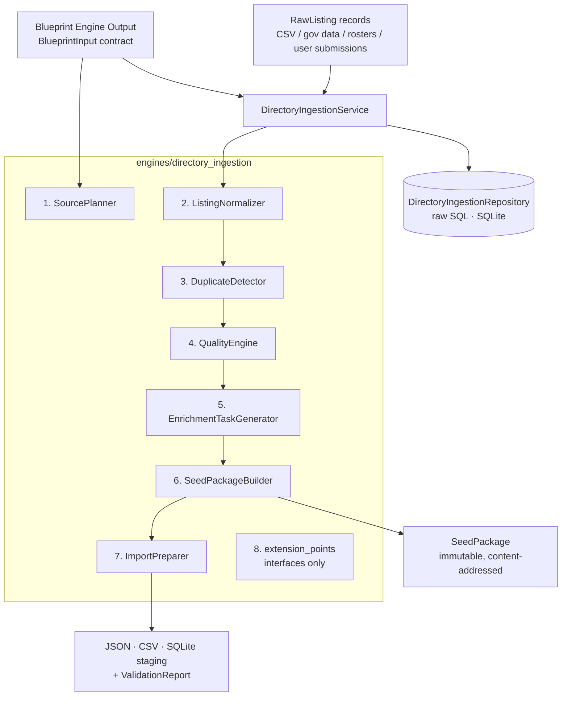
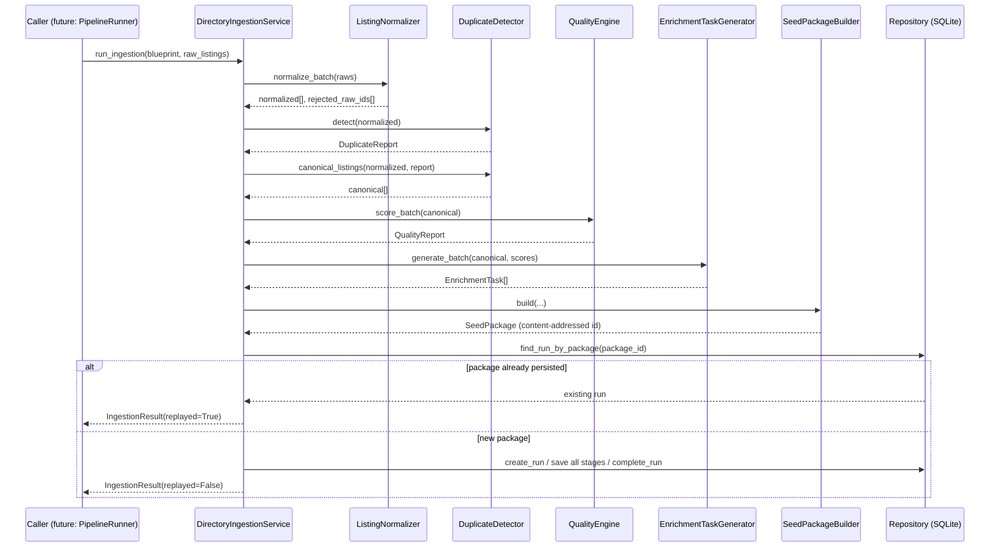
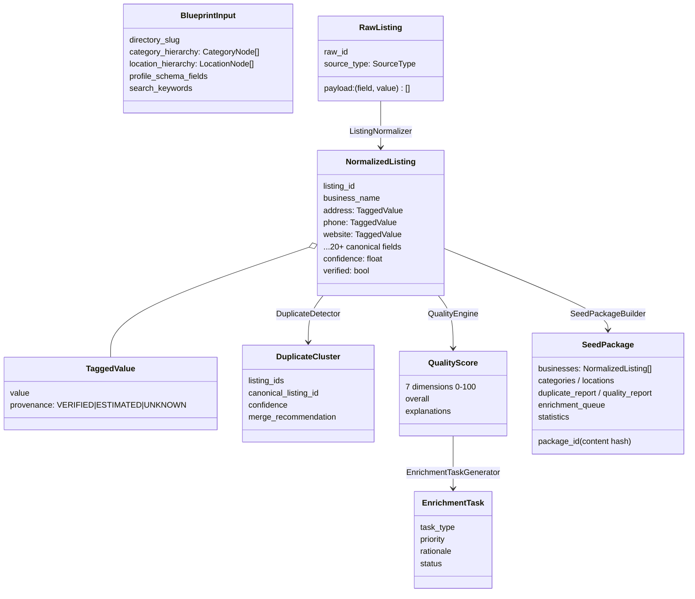

# Directory Data Ingestion & Seeding Engine

**Atlas Dashboard — Phase 3B** · Engine `directory_ingestion` v1.0.0

The permanent data-acquisition foundation for every future Atlas directory.
Consumes Blueprint Engine output, ingests raw listings from any source,
and produces a Normalized Directory Seed Package ready for the future
Directory Builder.

```
Blueprint Engine → Directory Data Ingestion Engine → Future Directory Builder
                                                   → Future AI Employees
                                                   → Future Website Generator
```

This subsystem does **not** build websites and does **not** scrape live
sites. It is the complete ingestion framework with extension points
reserved for future providers.

---

## Architecture Diagram



Layering matches the frozen Atlas contract exactly: engines hold pure
deterministic logic, the service orchestrates, the repository is the only
place SQL exists, and (once integrated) PipelineRunner remains the sole
top-level orchestrator and database writer.

## Sequence Diagram — `run_ingestion`



## Class Diagram — core models



---

## Module Reference

### 1. SourcePlanner (`source_planner.py`)
Ranks all eight acquisition strategies (Google Places, public directories,
association websites, government open data, CSV imports, user submissions,
future scrapers, future APIs) across quality, coverage, freshness,
difficulty, cost, and reliability. Weights are named constants summing to
100. Regulated-niche keyword detection boosts government-open-data
coverage deterministically. Future sources are ranked but flagged
`implemented=False`.

### 2. ListingNormalizer (`listing_normalizer.py`)
Declarative, reusable `FieldMapping` profiles translate any source
vocabulary into the canonical Atlas listing shape (all 24 fields from the
spec). Dedicated normalizers clean phones (→ `(614) 555-0101`), websites
(scheme + trailing-slash), emails, state names → codes, ZIPs, and
coordinates (range-validated). Invalid values become
`TaggedValue(None, UNKNOWN)` — never silently kept. Records with no
recoverable business name are rejected and surfaced in
`IngestionResult.rejected_raw_ids`. Confidence = base + per-core-field
increments + verified-source bonus, capped at 1.0.

### 3. DuplicateDetector (`duplicate_detector.py`)
Blocking keys (normalized phone, website domain, name-token+city, ~1 km
geo grid) generate candidate pairs without O(n²) comparison. Pairs are
scored with weighted signals (name 0.35, phone 0.20, website 0.15,
address 0.15, geo 0.10, city/state 0.05) using Jaccard token similarity
and haversine proximity — pure Python, zero dependencies. Union-find
clusters pairs ≥ 0.60; clusters ≥ 0.85 confidence → `AUTO_MERGE`,
otherwise `REVIEW`. Canonical record = verified > confidence > populated
fields > id (fully deterministic tiebreak).

### 4. QualityEngine (`quality_engine.py`)
Seven dimensions, each 0–100: completeness (field-weighted), contact
quality, location accuracy, SEO readiness, monetization readiness,
verification quality, freshness. Overall is a weighted sum (weights total
100). Freshness in Phase 3B is honestly documented as a source-type prior
(no crawl timestamps exist yet). Every score ships with human-readable
explanations. Import-grade threshold: 60.

### 5. EnrichmentTaskGenerator (`enrichment_generator.py`)
Ten explicit rules map listing gaps + quality scores to the ten task
types from the spec. Task ids are stable hashes of
`listing_id::task_type`, so replays never mint duplicate work. Queue is
sorted priority → type → listing. These records are the job contract for
future AI Employees.

### 6. SeedPackageBuilder (`seed_package_builder.py`)
Assembles businesses (canonical, sorted), blueprint categories and
locations, both reports, the enrichment queue, statistics, and engine
metadata. `package_id` is a content hash of the directory slug + listing
ids — identical inputs always produce the identical package id
(Prediction Ledger–style idempotency).

### 7. ImportPreparer (`import_preparer.py`)
Serializes a SeedPackage to JSON (canonical interchange, also the future
API payload shape), CSV (flat business file), and a self-contained SQLite
staging SQL script. Every artifact carries a `ValidationReport` checking
id uniqueness, required names, locatability, category↔blueprint
referential integrity, and task→listing references. Errors fail
validation; warnings do not.

### 8. Extension Points (`extension_points.py`)
Abstract `ListingProvider` contract plus reserved interfaces for Google
Places, OpenStreetMap, Yelp, Apple Maps, Facebook, LinkedIn, scrapers,
and an `LLMEnrichmentProvider` for AI Employees. **Interfaces only —
nothing implemented**, per spec. LLM enrichment output is contractually
tagged ESTIMATED, never VERIFIED, preserving the honest wall.

### 9. Storage
`models/directory_ingestion_schema.sql` — eight `di_`-prefixed tables
layered on top of the existing schema (no existing table touched).
`repositories/directory_ingestion_repository.py` — raw SQL only, zero
business logic, full round-trip fidelity including provenance tags.

### 10. Testing
`tests/test_directory_ingestion.py` — 49 tests, all offline. Fixtures
include clean, duplicate (three-source same-business), and incomplete/
broken datasets. Covers every module, repository round trips, full
pipeline persistence, idempotent replay, and cross-database determinism
of package ids.

---

## Honesty Layer

Every optional field is a `TaggedValue` with provenance:

| Tag | Meaning |
|---|---|
| `VERIFIED` | From an authoritative source (government open data, association rosters) |
| `ESTIMATED` | Normalized from a non-authoritative source |
| `UNKNOWN` | Missing or failed validation |

Provenance survives persistence (`provenance_json`) and export, so the
future Directory Builder and Investment Committee inherit honest inputs.
This is the same discipline as the existing 45%-cap honest wall: the
ingestion layer never upgrades data it cannot vouch for.

## Determinism Guarantees

* No randomness, no wall-clock inputs to any score or id.
* All ids (`lst_`, `dup_`, `tsk_`, `seed_`, `run_`) are SHA-256 content
  hashes — replay-safe across machines and databases.
* All sort orders have explicit deterministic tiebreaks.
* Every scoring constant is named and documented in-module.
