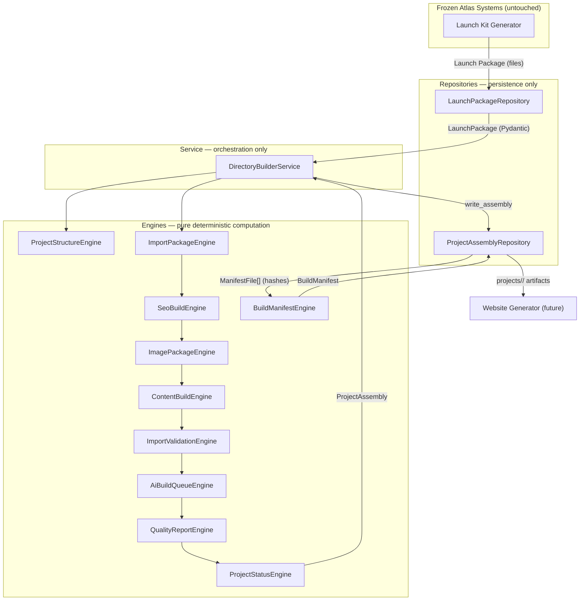

# Directory Builder — Architecture

## Architecture diagram



## Sequence diagram

```mermaid
sequenceDiagram
    participant Caller
    participant Service as DirectoryBuilderService
    participant LPR as LaunchPackageRepository
    participant Engines as Engines (pure)
    participant PAR as ProjectAssemblyRepository

    Caller->>Service: build_project(package_dir, built_at?)
    Service->>LPR: load(package_dir)
    LPR-->>Service: LaunchPackage (validated, frozen)
    Service->>Engines: structure → imports → seo → images → content
    Service->>Engines: validation → queue → quality → status
    Engines-->>Service: ProjectAssembly (validated, frozen)
    Service->>PAR: write_assembly(assembly)
    PAR-->>Service: ManifestFile[] (path, sha256, bytes)
    Service->>Engines: BuildManifestEngine.build(package, slug, built_at, files)
    Engines-->>Service: BuildManifest (clock-independent build_id)
    Service->>PAR: write_manifest(assembly, manifest)
    Service-->>Caller: BuildResult
```

## Class diagram

```mermaid
classDiagram
    class DirectoryBuilderService {
        -LaunchPackageRepository _launch_packages
        -ProjectAssemblyRepository _assemblies
        +build_project(package_dir, built_at) BuildResult
    }

    class LaunchPackageRepository {
        +load(package_dir) LaunchPackage
    }
    class ProjectAssemblyRepository {
        +project_path(slug) Path
        +write_assembly(assembly) ManifestFile[]
        +write_manifest(assembly, manifest) str[]
    }

    class ProjectStructureEngine { +build(slug) ProjectStructurePlan }
    class ImportPackageEngine { +build(package) ImportPackage }
    class SeoBuildEngine { +build(package, imports) SeoBuildPackage }
    class ImagePackageEngine { +build(package, imports) ImagePackage }
    class ContentBuildEngine { +build(package, imports, seo, images) ContentBuildPackage }
    class ImportValidationEngine { +build(imports, seo) ValidationReport }
    class AiBuildQueueEngine { +build(package, imports, content, images) AiBuildQueue }
    class QualityReportEngine { +build(...) QualityReport }
    class ProjectStatusEngine { +build(slug, quality, validation, queue) ProjectStatus }
    class BuildManifestEngine {
        +input_fingerprint(package) str
        +build(package, slug, built_at, files) BuildManifest
    }

    class LaunchPackage
    class ProjectAssembly
    class BuildManifest
    class BuildResult

    DirectoryBuilderService --> LaunchPackageRepository
    DirectoryBuilderService --> ProjectAssemblyRepository
    DirectoryBuilderService ..> ProjectStructureEngine
    DirectoryBuilderService ..> ImportPackageEngine
    DirectoryBuilderService ..> SeoBuildEngine
    DirectoryBuilderService ..> ImagePackageEngine
    DirectoryBuilderService ..> ContentBuildEngine
    DirectoryBuilderService ..> ImportValidationEngine
    DirectoryBuilderService ..> AiBuildQueueEngine
    DirectoryBuilderService ..> QualityReportEngine
    DirectoryBuilderService ..> ProjectStatusEngine
    DirectoryBuilderService ..> BuildManifestEngine
    LaunchPackageRepository ..> LaunchPackage : produces
    DirectoryBuilderService ..> ProjectAssembly : assembles
    BuildResult *-- ProjectAssembly
    BuildResult *-- BuildManifest
```



## Layer rules

| Layer | Location | Allowed | Forbidden |
|---|---|---|---|
| Models | `engines/directory_builder/models.py` | Pydantic, validation | logic, I/O |
| Engines | `engines/directory_builder/` | pure computation, named constants | I/O, clocks, randomness, Flask, SQL |
| Repositories | `repositories/directory_builder/` | file read/write, serialization | business logic, orchestration |
| Service | `services/directory_builder_service.py` | orchestration, dependency wiring | computation, serialization, Flask |
